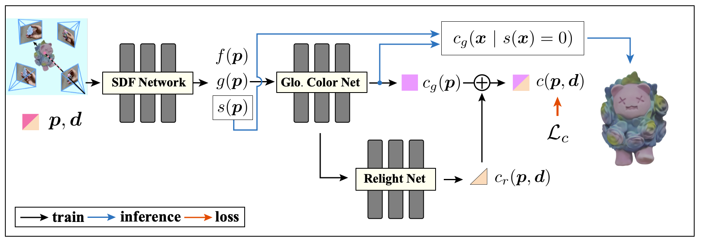

<p align="center">

  <h1 align="center">Color-NeuS: Reconstructing Neural Implicit Surfaces with Color</h1>
  <p align="center">
    <a><strong>Licheng Zhong</strong></a>
    ·
    <a><strong>Lixin Yang</strong></a>
    ·
    <a><strong>Kailin Li</strong></a>
    ·
    <a><strong>Haoyu Zhen</strong></a>
    ·
    <a><strong>Mei Han</strong></a>
    .
    <a><strong>Cewu Lu</strong></a>
  </p>

<h2 align="center">3DV 2024</h2>
</p>

<h3 align="center">
  <a href="https://colmar-zlicheng.github.io/color_neus"><strong>Project Page</strong></a>
  |
  <a href="https://arxiv.org/abs/2308.06962"><strong>arXiv</strong></a>
  |
  <a href="https://drive.google.com/drive/folders/1C6vcRiy_MFMtsaR8AydRAPrLIkok-tJm?usp=sharing"><strong>Data</strong></a>
</h3>

<div align="center">
  
</div>

https://github.com/Colmar-zlicheng/Color-NeuS/assets/111580763/5b9a3ed9-7d4f-48d9-84b5-a60a0a6adef9

## :rocket: Dependencies
```shell
git clone https://github.com/Colmar-zlicheng/Color-NeuS.git
cd Color-NeuS
conda install pytorch torchvision torchaudio pytorch-cuda=11.8 -c pytorch -c nvidia
pip install -r requirement.txt
pip install "git+https://github.com/facebookresearch/pytorch3d.git"
```
## :steam_locomotive: Train
### Dataset
- [IHO Video](https://drive.google.com/drive/folders/1C6vcRiy_MFMtsaR8AydRAPrLIkok-tJm?usp=sharing)
- DTU ([NeuS Preprocess Link](https://www.dropbox.com/sh/w0y8bbdmxzik3uk/AAAaZffBiJevxQzRskoOYcyja?dl=0) | [Raw Link](http://roboimagedata.compute.dtu.dk/))
- BlendedMVS ([NeuS Preprocess Link](https://www.dropbox.com/sh/w0y8bbdmxzik3uk/AAAaZffBiJevxQzRskoOYcyja?dl=0) | [Raw Link](https://github.com/YoYo000/BlendedMVS))
- [OmniObject3D](https://opendatalab.com/OpenXD-OmniObject3D-New)

### General command
- set `${DATASET}` as one in `[iho, dtu, bmvs, omniobject3d]`
- set `${OBJECT_NAME}` as the name of the object in the dataset

```shell 
python train.py -g 0 --cfg configs/Color_NeuS_${DATASET}.yaml -obj ${OBJECT_NAME} --exp_id ${EXP_ID}
```

### Command line arguments
- `-g, --gpu_id`, visible GPUs for training, e.g. `-g 0`. Only supports single GPU.
- `--exp_id` specify the name of experiment, e.g. `--exp_id ${EXP_ID}`. When `--exp_id` is provided, the code requires that no uncommitted change is remained in the git repo. Otherwise, it defaults to `'default'` for training and `'eval_{cfg}_{OBJECT_NAME}'` for evaluation. All results will be saved in `exp/${EXP_ID}*{timestamp}`.

### For example
```shell
# IHO Video: ghost_bear
python train.py -g 0 --cfg configs/Color_NeuS_iho.yaml -obj ghost_bear --exp_id Color_NeuS_iho_ghost_bear
# DTU: dtu_scan83
python train.py -g 0 --cfg configs/Color_NeuS_dtu.yaml -obj 83 --exp_id Color_NeuS_dtu_83
# BlendedMVS: bmvs_bear
python train.py -g 0 --cfg configs/Color_NeuS_bmvs.yaml -obj bear --exp_id Color_NeuS_bmvs_bear
# OmniObject3D: doll_002
python train.py -g 0 --cfg configs/Color_NeuS_omniobject3d.yaml -obj doll_002 --exp_id Color_NeuS_omniobject3d_doll_002
```

### Checkpoint
All the training checkpoints are saved at `exp/${EXP_ID}_{timestamp}/checkpoints/`

### Other Method
We also provide our implementation of [NeuS](https://github.com/Totoro97/NeuS) in this repo. To train NeuS, you can replace `Color_NeuS_${DATASET}.yaml` with `NeuS_${DATASET}.yaml` in the above command line, such as:
```shell
# IHO Video: ghost_bear
python train.py -g 0 --cfg configs/NeuS_iho.yaml -obj ghost_bear --exp_id NeuS_iho_ghost_bear
```

## :monocle_face: Inference  
- set corresponding `${DATASET}` and `${OBJECT_NAME}` as above
- set `${PATH_TO_CHECKPOINT}` as the path to the checkpoint (NeuS_Trainer.pth.tar) to be loaded
```shell
python evaluation.py -g 0 --cfg configs/Color_NeuS_${DATASET}.yaml -obj ${OBJECT_NAME} -rr 512 --reload ${PATH_TO_CHECKPOINT}
```
- `-rr, --recon_res` is the resolution of the reconstructed mesh. The default value is 512.
## :key: License

This code is available for non-commercial scientific research purposes as defined in the [LICENSE](LICENSE) file. By downloading and using the code you agree to the terms in the [LICENSE](LICENSE).

## :earth_asia: Citation

```bibtex
@inproceedings{zhong2024colorneus,
    title     = {Color-NeuS: Reconstructing Neural Implicit Surfaces with Color},
    author    = {Zhong, Licheng and Yang, Lixin and Li, Kailin and Zhen, Haoyu and Han, Mei and Lu, Cewu},
    booktitle = {International Conference on 3D Vision (3DV)},
    year      = {2024}
}
```

For more questions, please contact Licheng Zhong: zlicheng@sjtu.edu.cn
